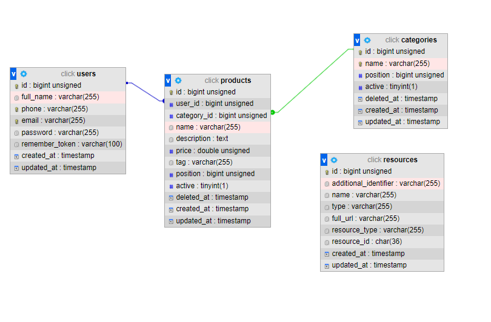

## Description
Administrators can create companies and appoint a director. Each director can change the details of his company and hire, fire an employee from his company.
Every employee has the permission to receive information about his company and edit his profile.

:white_check_mark: The `superAdmin` has all permissions that he can manage administrators, companies, roles, positions, employees.
And can change permissions from roles.
##

### Used

- **[`Php 8`](https://www.php.net/releases/8.0/ru.php#:~:text=PHP%208.0%20%E2%80%94%20%D0%B1%D0%BE%D0%BB%D1%8C%D1%88%D0%BE%D0%B5%20%D0%BE%D0%B1%D0%BD%D0%BE%D0%B2%D0%BB%D0%B5%D0%BD%D0%B8%D0%B5%20%D1%8F%D0%B7%D1%8B%D0%BA%D0%B0,%D1%82%D0%B8%D0%BF%D0%BE%D0%B2%2C%20%D0%BE%D0%B1%D1%80%D0%B0%D0%B1%D0%BE%D1%82%D0%BA%D0%B5%20%D0%BE%D1%88%D0%B8%D0%B1%D0%BE%D0%BA%20%D0%B8%20%D0%BA%D0%BE%D0%BD%D1%81%D0%B8%D1%81%D1%82%D0%B5%D0%BD%D1%82%D0%BD%D0%BE%D1%81%D1%82%D0%B8.)**
- **[`Laravel 8`](https://laravel.com/)**
- **[`MySQL`](https://www.mysql.com/)**
- **[`Laravel Sanctum`](https://laravel.com/docs/8.x/sanctum/)**
- **[`Laravel-permission`](https://spatie.be/docs/laravel-permission/v5/introduction)**

# In Project
<a href="https://documenter.getpostman.com/view/9990014/UVC8B5ht" target="_blank">
### Global postman documentation [](https://documenter.getpostman.com/view/9990014/UVC8B5ht)
> <a href="public/kesh_app.pdf" download>documentation Pdf</a><br>
> <a href="public/kesh_app.postman_collection.json" download>Postman Collection</a>

<details><summary><b style="color:#355C7D;font-size:20px">DataBase</b></summary>

> 

</details>

#### <b style="color:#35a79c ">Authentication Using Laravel `Sanctum`</b>

     Registratioin
     Login
     logout
     refresh Refresh token

<details><summary><b style="color:#17A2B8">CRUD</b></summary>

> C create

> R read

> U update

> D delete


</details>
<details><summary><b style="color:#355C7D;font-size:18px">Public api</b></summary>

```
- categories R
- product R
- search
```
</details>

<details><summary><b style="color:#355C7D;font-size:20px">User</b></summary>

```
- Profile RU
- User CRUD --- set role
- Role CRUD
- Category CRUD
- Product CRUD
```
</details>

